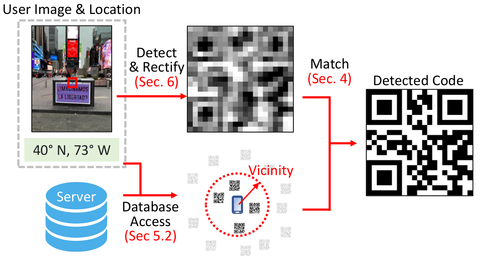
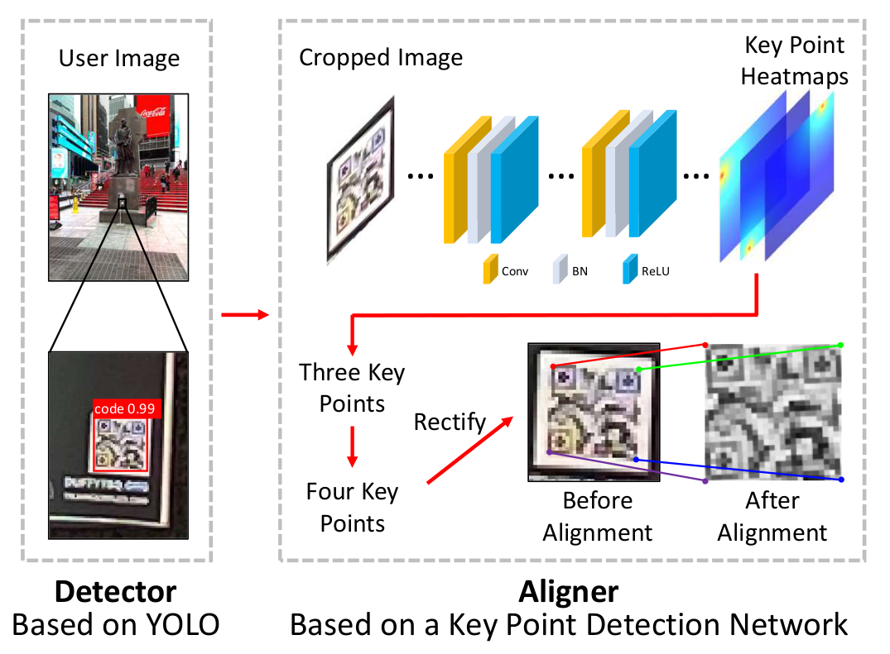
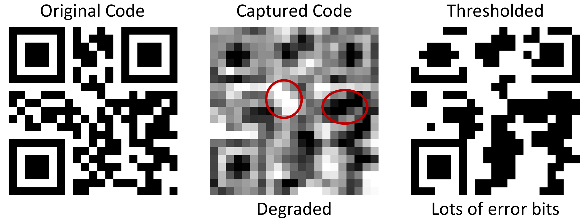

# QfaR: Location-Guided Scanning of Visual Codes from Long Distances
[\[Paper\]](https://sizhuom.github.io/project-qfar/static/pdf/MOBICOM_2023___QfaR.pdf) [\[Website\]](https://sizhuom.github.io/project-qfar/)

[Sizhuo Ma](https://sizhuoma.netlify.app/)<sup>1</sup>, [Jian Wang](https://jianwang-cmu.github.io/)<sup>1</sup>, [Wenzheng Chen](https://www.cs.toronto.edu/~wenzheng/)<sup>3</sup>, [Suman Banerjee](https://pages.cs.wisc.edu/~suman/)<sup>2</sup>, [Mohit Gupta](https://wisionlab.com/people/mohit-gupta/)<sup>2</sup>, [Shree Nayar](https://www.cs.columbia.edu/~nayar/)<sup>1</sup>

<sup>1</sup>Snap Inc., <sup>2</sup>University of Wisconsin-Madison, <sup>3</sup>University of Toronto

## Overview
This is the official implementation of QfaR, a location-guided QR code scanner. The complete pipeline of the proposed method is described as follows: When the user wants to scan a code, the app will take a picture of the current scene. The captured image is sent to a QR code detector which crops out only the part of the image that contains the code. Simultaneously, the GPS location of the user will be sent to a database and look up a list of QR codes within the vicinity. The scanned code image is then matched to the list of codes using the intensity-based matching described above. In this repo, we generate random QR codes as our candidated codes.

<p align="center">
  
</p>

## Code Detection
We first use a YOLO network to detect a bounding box of the QR code in the scene. We then use a key point detection network to predict a heat map for potential key points (3 corners) The fourth corner is predicted by assuming the four key points form a parallelogram (weak-perspective projection). A homography is computed to transform the paralellogram to a square (rectification) such that codes captured at different viewing angles can be matched directly. Both networks are trained with simulation data with physics-based imaging models.
<p align="center">
  
</p>

## Intensity-Based Matching
How to find the correct code from the pruned list? Conventional decoders apply thresholding to the captured degraded code image to get a binary code, which contains lots of error bits and therefore cannot be decoded.
Although the captured code image is heavily degraded, it still contains visual features such as blobs of black/white bits.
Therefore, we propose to treat these captured code as "images" and match based on their intensities. 
Specifically, we find the candidate code <math display="inline"><mrow><mi>D</mi></mrow></math> with shortest L2 distance to scanned code <math display="inline"><mrow><msub><mi>I</mi><mi>m</mi></msub></mrow></math> (template matching)
<math display="block" xmlns="http://www.w3.org/1998/Math/MathML">
  <mrow>
    <msub>
      <mi>D</mi>
      <mi>m</mi>
    </msub>
    <mo>=</mo>
    <!-- <mo>argmi</mo> -->
    <!-- <mi>r</mi>
    <mi>g</mi>
    <mi>m</mi>
    <mi>i</mi> -->
    <msub>
      <mo>argmin</mo>
      <mrow>
        <mi>D</mi>
        <mo>∈</mo>
        <mi>S</mi>
      </mrow>
    </msub>
    <msub>
      <mi>d</mi>
      <mrow>
        <mi>L</mi>
        <mn>2</mn>
      </mrow>
    </msub>
    <mrow>
      <mo stretchy="true" form="prefix">(</mo>
      <msub>
        <mi>I</mi>
        <mi>m</mi>
      </msub>
      <mo>,</mo>
      <mi>D</mi>
      <mo stretchy="true" form="postfix">)</mo>
    </mrow>
    <mspace width="0.167em" />
    <mi>.</mi>
  </mrow>
</math>
Please refer to the paper for more insights and reasoning behind this design.

<p align="center">
  
</p>

## Quick Start
### Clone the repository
```
git clone https://github.com/snap-research/qfar.git
cd qfar
```
### Create conda environment
```
conda env create -f environment.yml
```
Notice this environment only contains CPU-only pytorch libraries. Please modify environment.yml accordingly if you need GPU inference.

Tested on:

* python=3.8
* pytorch=2.0.0
* opencv=4.8

### Download pretrained aligner/detector models
Download pretrained models at https://www.dropbox.com/scl/fo/3jfd836ax7evte48d1tl6/h?rlkey=q2g4by9zxddzgfgq9rasiyhnu&dl=1 and place the checkpoints under ./aligner and ./detector.

### Run QfaR
```
conda activate qfar
python example_pipeline.py
```
This will run the pipeline described above (detector, aligner, decoder) on test images in the data/ folder. Please take a look at the code for detailed usage.

Output will be stored to results.txt. Below is an example.
```
IMG ID: 2
Matched code: 0
Matched ratio: 0.448256
Time for processing image 2: 0.015902
```
* IMG ID: ID of the test image
* Matched code: Index of the matched code. In the test examples, we always assume the ground truth code has an index of 0.
* Matched ratio: Confidence value of this match


## Contact
[Sizhuo Ma](https://sizhuoma.netlify.app/) (sizhuoma@gmail.com)

## Reference
```
@inproceedings{ma2023qfar,
  author    = {Ma, Sizhuo and Wang, Jian and Chen, Wenzheng and Banerjee, Suman and Gupta, Mohit and Nayar, Shree},
  title     = {QfaR: Location-Guided Scanning of Visual Codes from Long Distances},
  year      = {2023},
  booktitle = {Proceedings of the 29th Annual International Conference on Mobile Computing and Networking},
  articleno = {4},
  numpages = {14},
  series = {MobiCom '23}
}
```